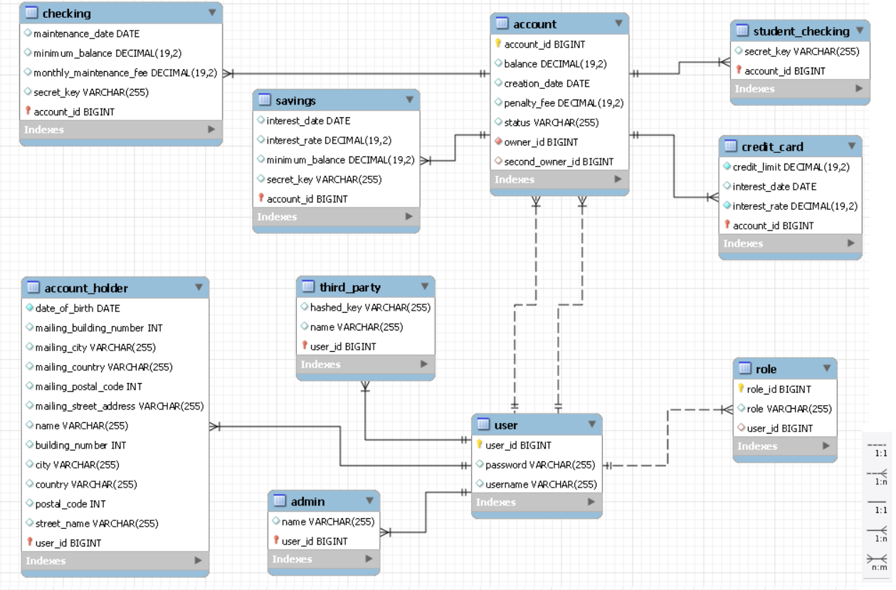

# BankingAPI
Welcome to my Banking API!

First of all, remember to change the application.properties to match your details!

Now lets take a look at the class diagram:

As you can see I have instantiated many addresses, accounts and users to make it easier to be tested.

There is only an Admin instantiated by default. Admin details are:
 -userID: 6
 -usename: admin1111
 -password: contrasena88
 -name: Admin1

There is also a Third Party already instantiated. Its details are:
-userID: 7
-usename: thirdpartymember
-password: password
-name: name
-hashedKey: hashed

If you are creating an accountholder and want to make it faster, there are 6 addresses already created.
Just type address1, address2, address3, address4, address5 or address6 on the constructor in order to get them.

However, you can use default account ID's from 1 to 14.

Same goes for users. You can use ID's from 1 to 7, being 6 the Admin and 7 the ThirdParty.

Here comes some help to use Postman much faster when you have to write the body or url:

-create account with one holder: /create-account-one-holder?holderId=1
{
"balance": 2900.00,
"secretKey": "pepepe888",
"typeOfAccount": "savings"
}

-create account with 2 holders: /create-account-two-holders?holderId=1&secondaryHolderId=2

{
"balance": 2900.00,
"secretKey": "pepepe888",
"typeOfAccount": "savings"
}

Not a big difference at all, right?

Some more bodies or urls:

/admin-check-balance?id=2

/admin-change-balance?accountId=2&newBalance=2000

/delete-account/3

/transfer?senderName=Sergio&senderId=1&amount=05&receiveId=4

/my-balance?accountId=1

/new-transfer?sendingId=1&amount=50&receiveId=2

/create-third-party

{
"username": "prueba",
"password": "password",
"name": "pablo",
"hashedKey": "hashed2"

}

/third-party-transfer?sendingAccountId=2&amount=50&receiveAccountId=4&secretKeySendingAccount=pepepe888
(remind the header!!)

And the final boss, you will thank me later:

/create-holder

{
"username": "test12285",
"password": "password",
"name": "Senior test",
"dateOfBirth": "1992-01-29",
"streetName": "calle test",
"buildingNumber": "8",
"postalCode":"9999",
"city": "ciudad test",
"country": "pais test",
"mailingStreetName": "mail street",
"mailingBuildingNumber": "55",
"mailingPostalCode": "5555",
"mailingCity": "ciudad mail",
"mailingCountry": "pais mail"
}

You can do it without mailing attributes if you prefer!

Hope this info is useful for you! 

